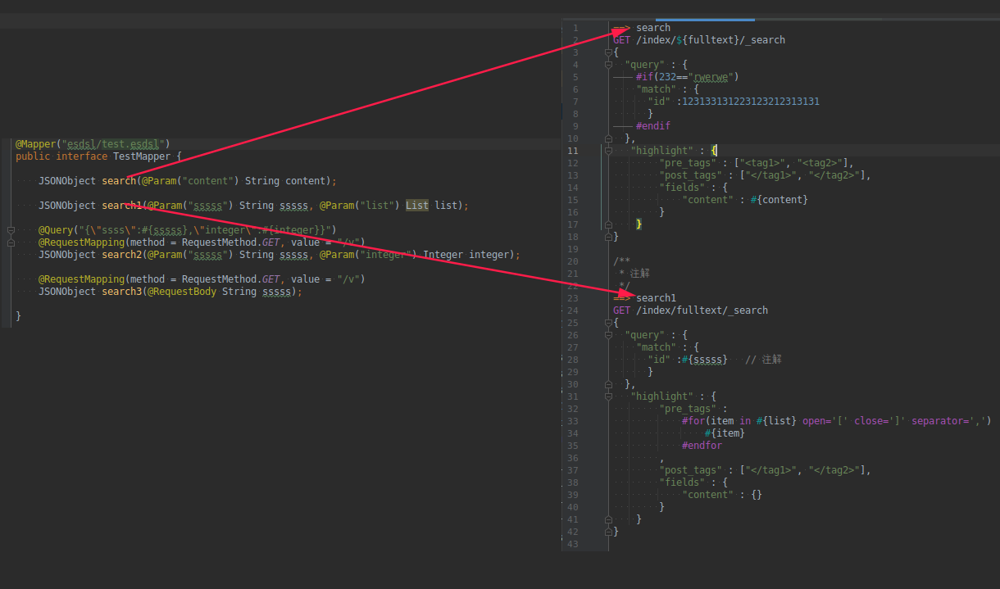

Esdsl elasticsearch query mapper framework for Java
===============================================

Esdsl 框架使得将 Elasticsearch 与面向对象应用程序结合使用变得更加容易。

# [Spring Boot 中使用请点击这里](https://github.com/manymobi/esdsl-spring)

# 如何使用?
   -   Maven:
       ```xml
       <dependency>
           <groupId>com.manymobi</groupId>
           <artifactId>esdsl-core</artifactId>
           <version>1.0.0-beta1</version>
       </dependency>
       ```
   -   Gradle
       ```groovy
       compile 'com.manymobi:esdsl-core:1.0.0-beta1'
       ```
       
```java
       RestClient restClient;

        esdsl = new Esdsl.Build()
                // esdsl文件目录
                .setEsdslFileResourceHandler(new PathEsdslFileResourceHandler(new File("src/test/resources/")))   
                // 设置Elasticsearch客户端
                .setRestHandler(new DefaultRestHandler(restClient))
                // 设置 json解码框架
                .setJsonEncoder(new FastjsonJsonEncoder())
                .build();
        // 获取Mapper对象
        TestMapper testMapper = esdsl.target(TestMapper.class);
        // 调用搜索
        testMapper.search("test");
```

### TestMapper 和 esdsl/test.esdsl文件内容 


# esdsl句法介绍
## 主体结构
    ==> {方法名}
    {请求方式} {请求地址}
    {json}
### 关键字
1. 请求方式: PUT POST GET DELETE
1. 判断: #if()  #elseif() #endif
   ```java
    #if(${name}=="1")
    "match" : {
      "id" :123133131223123212313131
      }
    #elseif(${name}=="2")
    "match" : {
      "id" :123133131223123212313131
      }
    #endif
    ```
1. 循环:  
    ```java
    #for(index,item in #{list} open='[' close=']' separator=',')
       #{item}
    #endfor
    ```
    1. index: 循环序号
    1. item: 循环的每一项
    1. list: 被循环的变量
    1. open: foreach代码的开始符号
    1. separator: 元素之间的分隔符
    1. close: foreach代码的关闭符号
    
1. 变量:#{} 会对变量预处理   ${}会直接拼接上

# mapper 方法支持返回对象
    1. Optional
    2. Future,CompletableFuture,CompletionStage
    3. 其他对象将使用使用json解析框架解析

# esdsl 语法校验
    请安装[插件](https://plugins.jetbrains.com/plugin/17572-esdsl)
